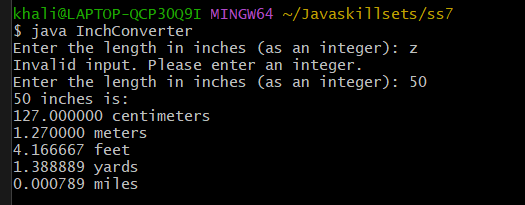
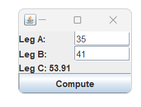
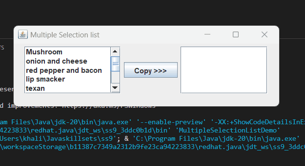

> **NOTE:** This README.md file should be placed at the **root of each of your repos directories.**
>
>Also, this file **must** use Markdown syntax, and provide project documentation as per below--otherwise, points **will** be deducted.
>

# LIS 4331

## Khalid Elhassan

### Project #1 Requirements:

*Sub-Heading:*

1. Mp4 of app orking
2. Screenshots of scrollable app
3. Screenshots of Skillsets for this assignment

#### README.md file should include the following items:

* Assignment demonstration with Gif and mp4
* Sillsets screenshots

> This is a blockquote.
> 
> This is the second paragraph in the blockquote.
>

#### Assignment Screenshots:

| *Video of app working*:                                                                                                                               | *Gif of horizontal*:      |   |   |   |
|-------------------------------------------------------------------------------------------------------------------------------------------------------|---------------------------|---|---|---|
| |  |   |   |   |
|                                                                                                                                                       |                           |   |   |   |
|                                                                                                                                                       |                           |   |   |   |

#### Sillsets Screenshots:

| *SS7*:                                  | *SS8*:                             | *SS9*:                            |   |   |
|-----------------------------------------|------------------------------------|-----------------------------------|---|---|
|  |   |  |   |   |
|                                         | |                                   |   |   |
|                                         |  |                                   |   |   |