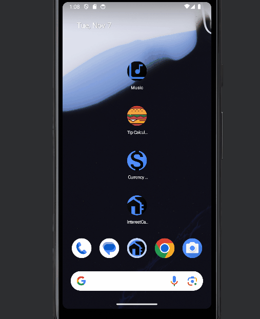
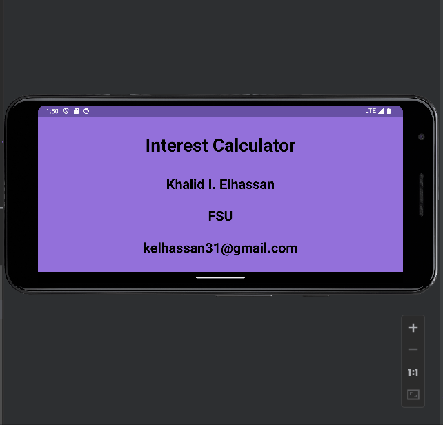
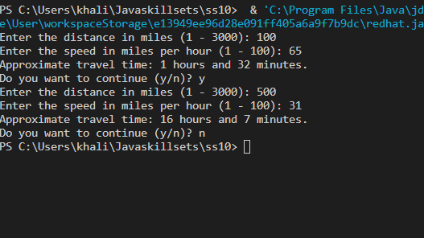
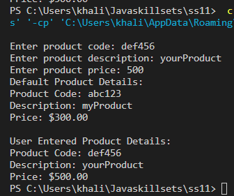
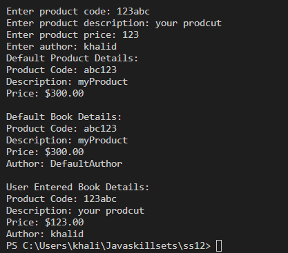

> **NOTE:** This README.md file should be placed at the **root of each of your repos directories.**
>
>Also, this file **must** use Markdown syntax, and provide project documentation as per below--otherwise, points **will** be deducted.
>

# LIS 4331

## Khalid Elhassan

### Assignment #4 Requirements:

*Sub-Heading:*

1. Screenshots of horizontal app
2. Screenshots of vertical app
3. Screenshots of Skillsets for this assignment

#### README.md file should include the following items:

* Assignment demonstration with Gif
* Sillsets screenshots

> This is a blockquote.
> 
> This is the second paragraph in the blockquote.
>

#### Assignment Screenshots:

| *Gif of app (vertical)*: | *Gif of app (horizontal)*: |   |   |   |
|--------------------------------|----------------------------------|---|---|---|
|       |        |   |   |   |
|                                |                                  |   |   |   |
|                                |                                  |   |   |   |

#### Sillsets Screenshots:

| *SS10*:                                  | *SS11*:                             | *SS12*:                            |   |   |
|-----------------------------------------|------------------------------------|-----------------------------------|---|---|
|  |   |  |   |   |
|                                         | |                                   |   |   |
|                                         | |                                   |   |   |