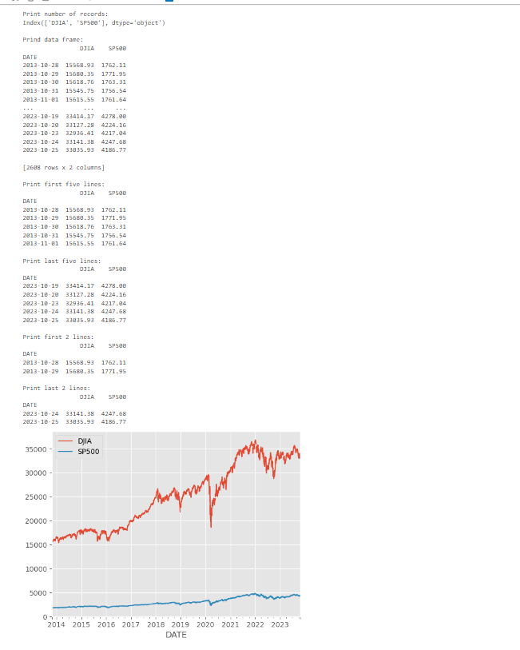
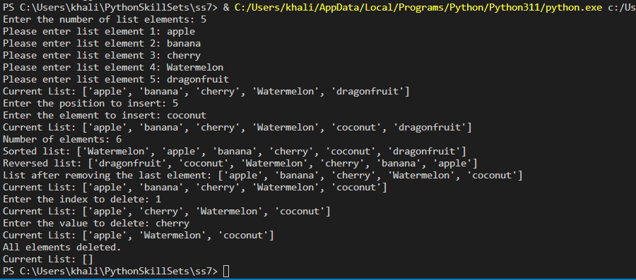
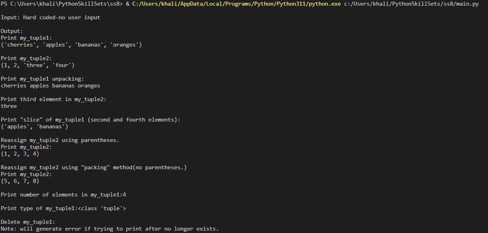
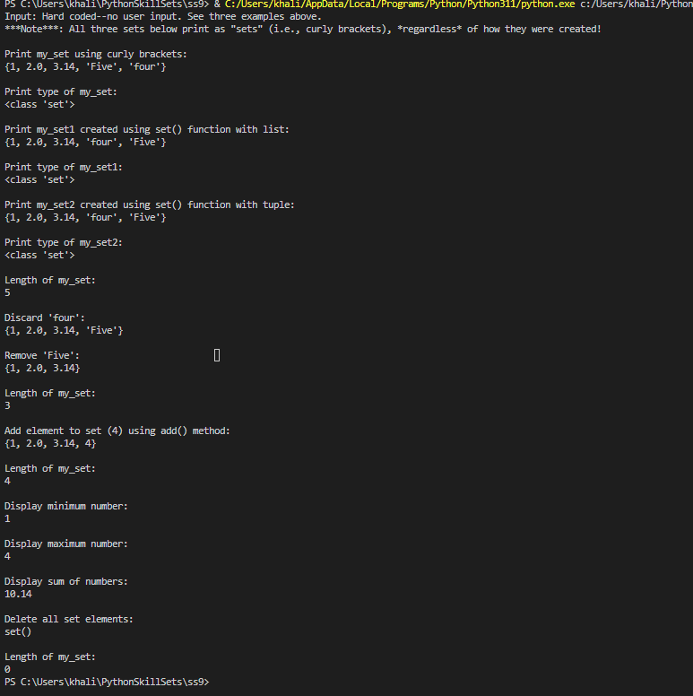

> **NOTE:** This README.md file should be placed at the **root of each of your repos directories.**
>
>Also, this file **must** use Markdown syntax, and provide project documentation as per below--otherwise, points **will** be deducted.
>

# LIS4369

## Khalid Elhassan

### Project 1 Requirements:

*Sub-Heading:*

1. Screenshots of application running on Jupyter
2. skillsets 7-9

#### README.md file should include the following items:

* Screenshots of Porject 1 on Jupyter notebook
* link to p1.ipynb file [p1.ipynb](p1.ipynb)
* skillsets for P1
> This is a blockquote.
> 
> This is the second paragraph in the blockquote.
>

#### Assignment Screenshots:

| *Screenshot of p1 Jupyter*:  |
|-------------------------------------------|
|       |
|                                           |
|                                           |

#### SkillSet Screenshots:

| *Screenshot of SS7*:              | *Screenshot of SS8*:              | *Screenshot of SS9*:              |   |   |
|-----------------------------------|-----------------------------------|-----------------------------------|---|---|
|  |  |  |   |   |
|                                   |                                   |                                   |   |   |
|                                   |                                   |                                   |   |   |