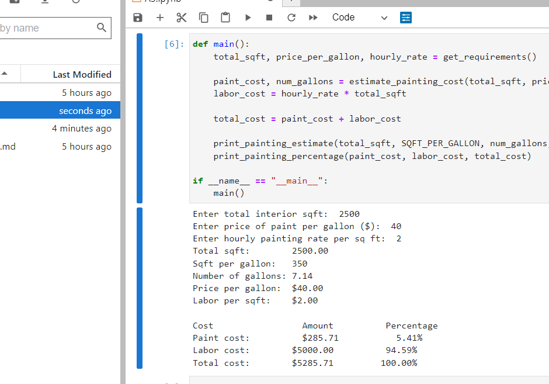
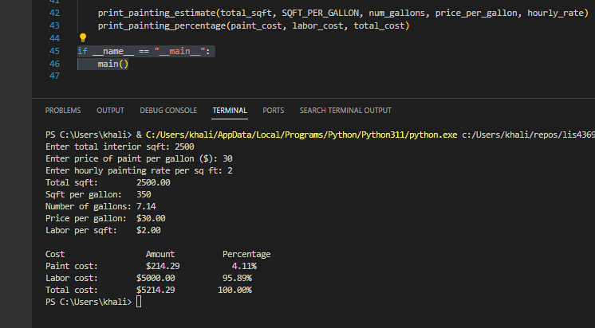
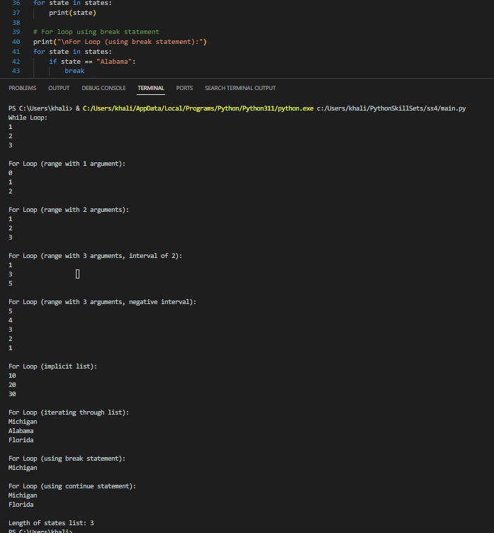
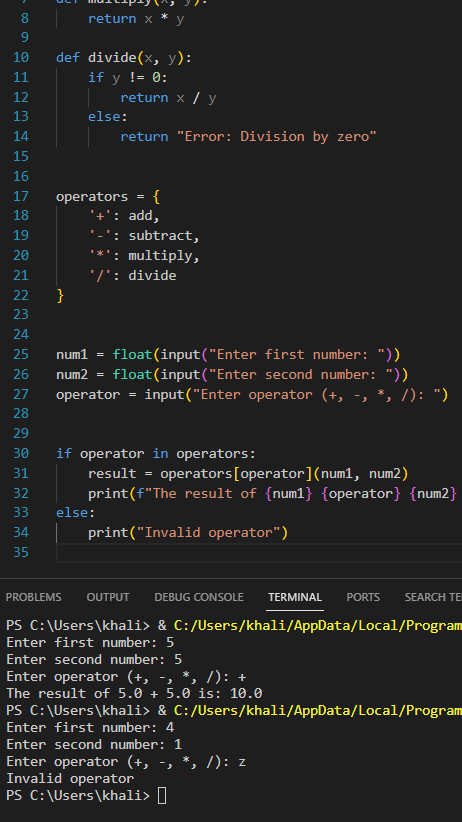
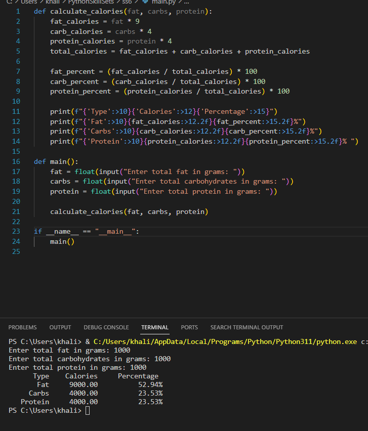

> **NOTE:** This README.md file should be placed at the **root of each of your repos directories.**
>
>Also, this file **must** use Markdown syntax, and provide project documentation as per below--otherwise, points **will** be deducted.
>

# LIS4369

## Khalid Elhassan

### Assignment #3 Requirements:

*Sub-Heading:*

1. Screenshots of application running on IDLE, Jupyter, and VSC
2. skillsets

#### README.md file should include the following items:

* Screenshots of payroll calculator running on IDLE, Jupyter, and VSC (with and without OT)
* link to A3.ipynb file
* skillsets for A3
> This is a blockquote.
> 
> This is the second paragraph in the blockquote.
>

#### Assignment Screenshots:
| *Screenshot of Paint Estimator Jupyter*:  | *Screenshot of Paint Estimator*:  |   |   |   |
|-------------------------------------------|-----------------------------------|---|---|---|
|  |  |   |   |   |
|                                           |                                   |   |   |   |
|                                           |                                   |   |   |   |

#### SkillSet Screenshots:

| *Screenshot of SS4*:              | *Screenshot of SS5*:              | *Screenshot of SS6*:              |   |   |
|-----------------------------------|-----------------------------------|-----------------------------------|---|---|
|  |  |  |   |   |
|                                   |                                   |                                   |   |   |
|                                   |                                   |                                   |   |   |