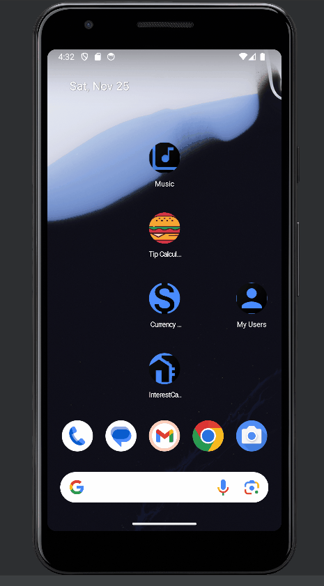
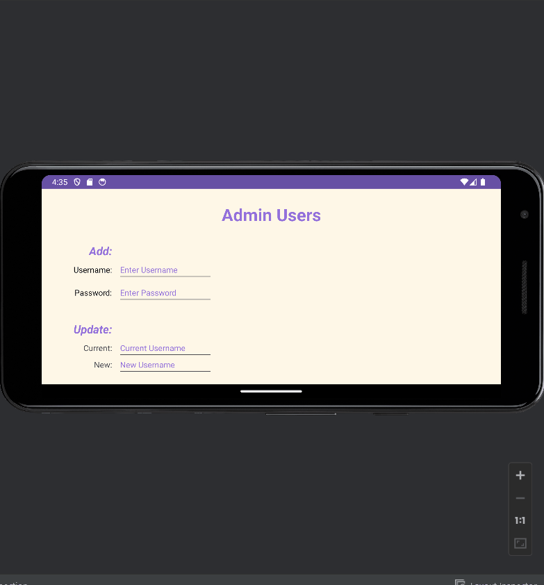

> **NOTE:** This README.md file should be placed at the **root of each of your repos directories.**
>
>Also, this file **must** use Markdown syntax, and provide project documentation as per below--otherwise, points **will** be deducted.
>

# LIS 4331

## Khalid Elhassan

### Simple Application Implementing SQLite database to save user information

*Sub-Heading:*

1. Gif of application working
2. includes source code

#### README.md file should include the following items:

* Assignment demonstration with Gif

> This is a blockquote.
> 
> This is the second paragraph in the blockquote.
>

#### Assignment Screenshots:

| *Gif of app (vertical)*:  | *Gif of app (horizontal)*: |   |   |   |
|---------------------------|----------------------------|---|---|---|
|  |  |   |   |   |
|                           |                            |   |   |   |
|                           |                            |   |   |   |